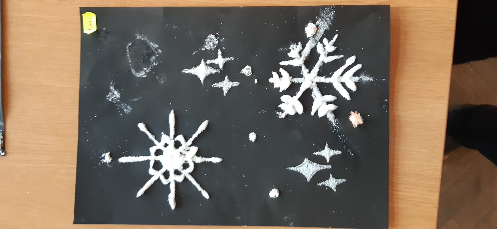
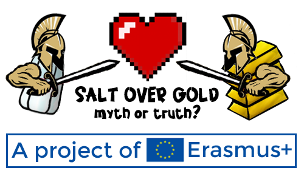
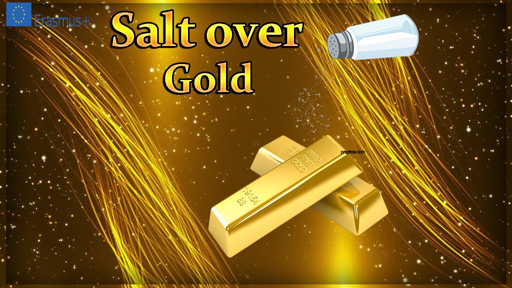
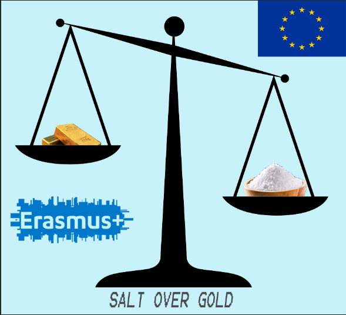

# Romania

## Websites

[Romanian Salt Mines - interactive map](https://maphub.net/Erasmussaltovergold/map)

[Calendar - The Romanian Salt Mines](https://www.calameo.com/read/005274096ddad59e4093a)

[Blog](https://saltovergoldromania.blogspot.com)

[Documentary](https://youtu.be/XZGHLNlDQ_k)

[The history of salt extraction in Romania](https://www.calameo.com/read/005274096f65a9cd16977)

[Quiz](https://create.kahoot.it/details/39710750-5b0a-4931-b2af-7d5b0bca574d)

[Salt Fairy Tales](https://www.calameo.com/read/005274096fe62aeed21b7)

## Salt in art - painting Christmas cards with salt

::: gallery
{onclick="window.open(this.src)"}
{onclick="window.open(this.src)"}
{onclick="window.open(this.src)"}
{onclick="window.open(this.src)"}
{onclick="window.open(this.src)"}
{onclick="window.open(this.src)"}
{onclick="window.open(this.src)"}
{onclick="window.open(this.src)"}
{onclick="window.open(this.src)"}
{onclick="window.open(this.src)"}
{onclick="window.open(this.src)"}
{onclick="window.open(this.src)"}
:::

## Romanian logo designs

::: gallery
{onclick="window.open(this.src)"}
{onclick="window.open(this.src)"}
{onclick="window.open(this.src)"}
{onclick="window.open(this.src)"}
{onclick="window.open(this.src)"}
{onclick="window.open(this.src)"}
:::
