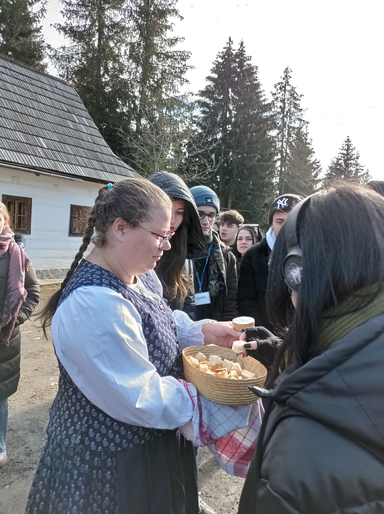

# LTT C4 - Slovakia

## Day 1 - 27.2. (Monday)

Welcome to school

Tour of the school

Reception by the Deputy Mayor of Košice in the Historical Town Hall

Guided tour in St Elisabeth Cathedral

North steeple of St.Elisabeth Cathedral (Kosice skyline)

::: gallery
{onclick="window.open(this.src)"}
{onclick="window.open(this.src)"}
{onclick="window.open(this.src)"}
{onclick="window.open(this.src)"}
{onclick="window.open(this.src)"}
{onclick="window.open(this.src)"}
{onclick="window.open(this.src)"}
{onclick="window.open(this.src)"}
{onclick="window.open(this.src)"}
{onclick="window.open(this.src)"}
{onclick="window.open(this.src)"}
{onclick="window.open(this.src)"}
{onclick="window.open(this.src)"}
:::

## Day 2 - 28.2. (Tuesday)

Trip to Pribylina – Museum of Liptov village (Slavic welcome ceremony with bread and salt)

Museum of salt, Prešov

::: gallery
{onclick="window.open(this.src)"}
{onclick="window.open(this.src)"}
{onclick="window.open(this.src)"}
{onclick="window.open(this.src)"}
{onclick="window.open(this.src)"}
{onclick="window.open(this.src)"}
{onclick="window.open(this.src)"}
{onclick="window.open(this.src)"}
{onclick="window.open(this.src)"}
{onclick="window.open(this.src)"}
{onclick="window.open(this.src)"}
{onclick="window.open(this.src)"}
{onclick="window.open(this.src)"}
{onclick="window.open(this.src)"}
:::

## Day 3 - 1.3. (Wednesday)

School activities:

Salt in art – workshop

Salt in chemical experiments (in chemistry laboratory)

Salt routes in the past (Slovak students´presentation + quiz)

Teachers´meeting

Interviews with a journalist (for a regional newspaper)

Science park: workshop with a chemist + exposition

Students: bowling

Teachers: dinner

::: gallery
{onclick="window.open(this.src)"}
{onclick="window.open(this.src)"}
{onclick="window.open(this.src)"}
{onclick="window.open(this.src)"}
{onclick="window.open(this.src)"}
{onclick="window.open(this.src)"}
{onclick="window.open(this.src)"}
{onclick="window.open(this.src)"}
{onclick="window.open(this.src)"}
{onclick="window.open(this.src)"}
{onclick="window.open(this.src)"}
{onclick="window.open(this.src)"}
{onclick="window.open(this.src)"}
{onclick="window.open(this.src)"}
{onclick="window.open(this.src)"}
{onclick="window.open(this.src)"}
{onclick="window.open(this.src)"}
{onclick="window.open(this.src)"}
{onclick="window.open(this.src)"}
{onclick="window.open(this.src)"}
{onclick="window.open(this.src)"}
{onclick="window.open(this.src)"}
{onclick="window.open(this.src)"}
{onclick="window.open(this.src)"}
{onclick="window.open(this.src)"}
{onclick="window.open(this.src)"}
{onclick="window.open(this.src)"}
{onclick="window.open(this.src)"}
{onclick="window.open(this.src)"}
{onclick="window.open(this.src)"}
{onclick="window.open(this.src)"}
:::

## Day 4 - 2.3. (Thursday)

Trip to Manor House of Betliar

Visit to Premonstratensian Monastery and library

Farewell dinner: Slovak folklore dances

Salt over gold – a modernised version of the fairy tale (performance)

Certificate giving ceremony

::: gallery
{onclick="window.open(this.src)"}
{onclick="window.open(this.src)"}
{onclick="window.open(this.src)"}
{onclick="window.open(this.src)"}
{onclick="window.open(this.src)"}
{onclick="window.open(this.src)"}
{onclick="window.open(this.src)"}
{onclick="window.open(this.src)"}
{onclick="window.open(this.src)"}
{onclick="window.open(this.src)"}
{onclick="window.open(this.src)"}
{onclick="window.open(this.src)"}
{onclick="window.open(this.src)"}
{onclick="window.open(this.src)"}
:::

## Day 5 - 3.3. (Friday)

Visit to Eastern Slovakian Museum (The Kosice Gold Treasure)

Treasure hunting

FREE AFTERNOON

::: gallery
{onclick="window.open(this.src)"}
{onclick="window.open(this.src)"}
{onclick="window.open(this.src)"}
{onclick="window.open(this.src)"}
{onclick="window.open(this.src)"}
{onclick="window.open(this.src)"}
{onclick="window.open(this.src)"}
{onclick="window.open(this.src)"}
{onclick="window.open(this.src)"}
{onclick="window.open(this.src)"}
{onclick="window.open(this.src)"}
{onclick="window.open(this.src)"}
{onclick="window.open(this.src)"}
{onclick="window.open(this.src)"}
{onclick="window.open(this.src)"}
{onclick="window.open(this.src)"}
:::
