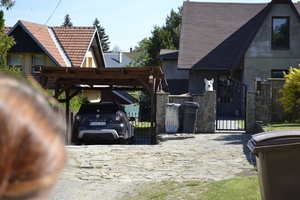
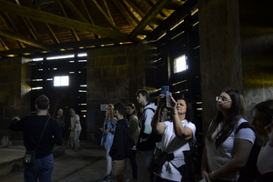
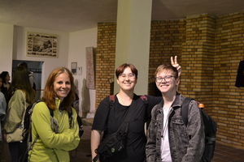
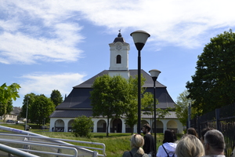
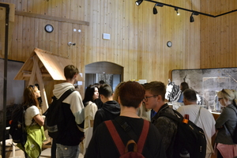

# Slovakia

3 September 2022

## Day of Salt - excursion to the Museum of salt, Solivar

 * guided tour in the museum
 * learning about salt mining in Slovakia
 * meeting miners from the partner salt mine in Wielicska, Poland

19 September 2022

## Salt in gastronomy - a workshop with a chef

 * using sea salt
 * various kinds of salt
 * marinating fish using salt
 * celery baked in salt crust
 * preparing 3-course dinner and tasting it

20 May 2022

## Visit to Museum of salt

We learnt about mining, production and processing of salt in the town of Prešov
in the past. Since 2016 it has been a national cultural and the most important
technical monument.

::: gallery
 * {onclick='window.open("full"+this.src)'}
 * {onclick='window.open("full"+this.src)'}
 * {onclick='window.open("full"+this.src)'}
 * {onclick='window.open("full"+this.src)'}
 * {onclick='window.open("full"+this.src)'}
 * {onclick='window.open("full"+this.src)'}
 * {onclick='window.open("full"+this.src)'}
 * {onclick='window.open("full"+this.src)'}
 * {onclick='window.open("full"+this.src)'}
 * {onclick='window.open("full"+this.src)'}
 * {onclick='window.open("full"+this.src)'}
 * {onclick='window.open("full"+this.src)'}
 * {onclick='window.open("full"+this.src)'}
 * {onclick='window.open("full"+this.src)'}
 * {onclick='window.open("full"+this.src)'}
 * {onclick='window.open("full"+this.src)'}
 * {onclick='window.open("full"+this.src)'}
 * {onclick='window.open("full"+this.src)'}
 * {onclick='window.open("full"+this.src)'}
 * {onclick='window.open("full"+this.src)'}
 * {onclick='window.open("full"+this.src)'}
 * {onclick='window.open("full"+this.src)'}
 * {onclick='window.open("full"+this.src)'}
 * {onclick='window.open("full"+this.src)'}
 * {onclick='window.open("full"+this.src)'}
 * {onclick='window.open("full"+this.src)'}
 * {onclick='window.open("full"+this.src)'}
 * {onclick='window.open("full"+this.src)'}
 * {onclick='window.open("full"+this.src)'}
 * {onclick='window.open("full"+this.src)'}
 * {onclick='window.open("full"+this.src)'}
 * {onclick='window.open("full"+this.src)'}
 * {onclick='window.open("full"+this.src)'}
 * {onclick='window.open("full"+this.src)'}
 * {onclick='window.open("full"+this.src)'}
 * {onclick='window.open("full"+this.src)'}
 * {onclick='window.open("full"+this.src)'}
 * {onclick='window.open("full"+this.src)'}
 * {onclick='window.open("full"+this.src)'}
 * {onclick='window.open("full"+this.src)'}
 * {onclick='window.open("full"+this.src)'}
 * {onclick='window.open("full"+this.src)'}
 * {onclick='window.open("full"+this.src)'}
 * {onclick='window.open("full"+this.src)'}
 * {onclick='window.open("full"+this.src)'}
 * {onclick='window.open("full"+this.src)'}
 * {onclick='window.open("full"+this.src)'}
 * {onclick='window.open("full"+this.src)'}
 * {onclick='window.open("full"+this.src)'}
 * {onclick='window.open("full"+this.src)'}
 * {onclick='window.open("full"+this.src)'}
 * {onclick='window.open("full"+this.src)'}
 * {onclick='window.open("full"+this.src)'}
 * {onclick='window.open("full"+this.src)'}
 * {onclick='window.open("full"+this.src)'}
 * {onclick='window.open("full"+this.src)'}
 * {onclick='window.open("full"+this.src)'}
 * {onclick='window.open("full"+this.src)'}
 * {onclick='window.open("full"+this.src)'}
 * {onclick='window.open("full"+this.src)'}
 * {onclick='window.open("full"+this.src)'}
 * {onclick='window.open("full"+this.src)'}
 * {onclick='window.open("full"+this.src)'}
 * {onclick='window.open("full"+this.src)'}
 * {onclick='window.open("full"+this.src)'}
 * {onclick='window.open("full"+this.src)'}
 * {onclick='window.open("full"+this.src)'}
 * {onclick='window.open("full"+this.src)'}
 * {onclick='window.open("full"+this.src)'}
 * {onclick='window.open("full"+this.src)'}
 * {onclick='window.open("full"+this.src)'}
 * {onclick='window.open("full"+this.src)'}
 * {onclick='window.open("full"+this.src)'}
 * {onclick='window.open("full"+this.src)'}
 * {onclick='window.open("full"+this.src)'}
 * {onclick='window.open("full"+this.src)'}
 * {onclick='window.open("full"+this.src)'}
 * {onclick='window.open("full"+this.src)'}
 * {onclick='window.open("full"+this.src)'}
 * {onclick='window.open("full"+this.src)'}
 * {onclick='window.open("full"+this.src)'}
 * {onclick='window.open("full"+this.src)'}
 * {onclick='window.open("full"+this.src)'}
 * {onclick='window.open("full"+this.src)'}
 * {onclick='window.open("full"+this.src)'}
 * {onclick='window.open("full"+this.src)'}
 * {onclick='window.open("full"+this.src)'}
 * {onclick='window.open("full"+this.src)'}
 * {onclick='window.open("full"+this.src)'}
 * {onclick='window.open("full"+this.src)'}
 * {onclick='window.open("full"+this.src)'}
 * {onclick='window.open("full"+this.src)'}
 * {onclick='window.open("full"+this.src)'}
 * {onclick='window.open("full"+this.src)'}
 * {onclick='window.open("full"+this.src)'}
 * {onclick='window.open("full"+this.src)'}
 * {onclick='window.open("full"+this.src)'}
 * {onclick='window.open("full"+this.src)'}
 * {onclick='window.open("full"+this.src)'}
 * {onclick='window.open("full"+this.src)'}
 * {onclick='window.open("full"+this.src)'}
 * {onclick='window.open("full"+this.src)'}
 * {onclick='window.open("full"+this.src)'}
 * {onclick='window.open("full"+this.src)'}
 * {onclick='window.open("full"+this.src)'}
 * {onclick='window.open("full"+this.src)'}
 * {onclick='window.open("full"+this.src)'}
 * {onclick='window.open("full"+this.src)'}
 * {onclick='window.open("full"+this.src)'}
 * {onclick='window.open("full"+this.src)'}
 * {onclick='window.open("full"+this.src)'}
 * {onclick='window.open("full"+this.src)'}
 * {onclick='window.open("full"+this.src)'}
 * {onclick='window.open("full"+this.src)'}
 * {onclick='window.open("full"+this.src)'}
 * {onclick='window.open("full"+this.src)'}
 * {onclick='window.open("full"+this.src)'}
 * {onclick='window.open("full"+this.src)'}
 * {onclick='window.open("full"+this.src)'}
 * {onclick='window.open("full"+this.src)'}
 * {onclick='window.open("full"+this.src)'}
 * {onclick='window.open("full"+this.src)'}
 * {onclick='window.open("full"+this.src)'}
 * {onclick='window.open("full"+this.src)'}
 * {onclick='window.open("full"+this.src)'}
 * {onclick='window.open("full"+this.src)'}
 * {onclick='window.open("full"+this.src)'}
 * {onclick='window.open("full"+this.src)'}
 * {onclick='window.open("full"+this.src)'}
 * {onclick='window.open("full"+this.src)'}
 * {onclick='window.open("full"+this.src)'}
 * {onclick='window.open("full"+this.src)'}
 * {onclick='window.open("full"+this.src)'}
 * {onclick='window.open("full"+this.src)'}
 * {onclick='window.open("full"+this.src)'}
 * {onclick='window.open("full"+this.src)'}
 * {onclick='window.open("full"+this.src)'}
 * {onclick='window.open("full"+this.src)'}
 * {onclick='window.open("full"+this.src)'}
 * {onclick='window.open("full"+this.src)'}
 * {onclick='window.open("full"+this.src)'}
 * {onclick='window.open("full"+this.src)'}
 * {onclick='window.open("full"+this.src)'}
 * {onclick='window.open("full"+this.src)'}
 * {onclick='window.open("full"+this.src)'}
 * {onclick='window.open("full"+this.src)'}
 * {onclick='window.open("full"+this.src)'}
 * {onclick='window.open("full"+this.src)'}
 * {onclick='window.open("full"+this.src)'}
 * {onclick='window.open("full"+this.src)'}
 * {onclick='window.open("full"+this.src)'}
 * {onclick='window.open("full"+this.src)'}
 * {onclick='window.open("full"+this.src)'}
 * {onclick='window.open("full"+this.src)'}
 * {onclick='window.open("full"+this.src)'}
:::

---

17 May 2022

## Visit to Jasovksa Cave

The cave is rich in forms and colours of its dripstone ornamentation. An area
called the Bat cathedral is used for speleotherapy and climatotherapy of asthma
and allergic diseases.

::: gallery
 * {onclick="window.open(this.src)"}
 * {onclick="window.open(this.src)"}
 * {onclick="window.open(this.src)"}
 * {onclick="window.open(this.src)"}
 * {onclick="window.open(this.src)"}
 * {onclick="window.open(this.src)"}
 * {onclick="window.open(this.src)"}
:::

---

## Our project in the regional newspaper

---

20 October 2021

## How is salt harmful to our plants?

 * a practical session led by a biology teacher
 * doing experiments (short- term and long-term) focused on the impact of salt on plants

::: gallery
 * {onclick="window.open(this.src)"}
 * {onclick="window.open(this.src)"}
 * {onclick="window.open(this.src)"}
 * {onclick="window.open(this.src)"}
 * {onclick="window.open(this.src)"}
 * {onclick="window.open(this.src)"}
 * {onclick="window.open(this.src)"}
 * {onclick="window.open(this.src)"}
 * {onclick="window.open(this.src)"}
 * {onclick="window.open(this.src)"}
 * {onclick="window.open(this.src)"}
 * {onclick="window.open(this.src)"}
:::

---

4 September 2021

## Salt Day

 * organized by Museum Solivar, a national cultural and unique technical monument
 * our project team visited the facilities for the extraction of rock salt, technical objects for pumping and cooking salt and learnt a lot about the history of saltworks

::: gallery
 * {onclick="window.open(this.src)"}
 * {onclick="window.open(this.src)"}
 * {onclick="window.open(this.src)"}
 * {onclick="window.open(this.src)"}
 * {onclick="window.open(this.src)"}
 * {onclick="window.open(this.src)"}
 * {onclick="window.open(this.src)"}
 * {onclick="window.open(this.src)"}
:::

---

3 September 2021

## 1st project meeting in the school year 2021/22 

::: gallery
 * {onclick="window.open(this.src)"}
 * {onclick="window.open(this.src)"}
 * {onclick="window.open(this.src)"}
:::

---

18 March 2021

## Soil salinity 

 * soil health
 * impacts on plant growth and ecosystem
 * the problem of salinization

::: gallery
 * {onclick="window.open(this.src)"}
 * {onclick="window.open(this.src)"}
 * {onclick="window.open(this.src)"}
 * {onclick="window.open(this.src)"}
 * {onclick="window.open(this.src)"}
 * {onclick="window.open(this.src)"}
 * {onclick="window.open(this.src)"}
 * {onclick="window.open(this.src)"}
 * {onclick="window.open(this.src)"}
 * {onclick="window.open(this.src)"}
 * {onclick="window.open(this.src)"}
:::

