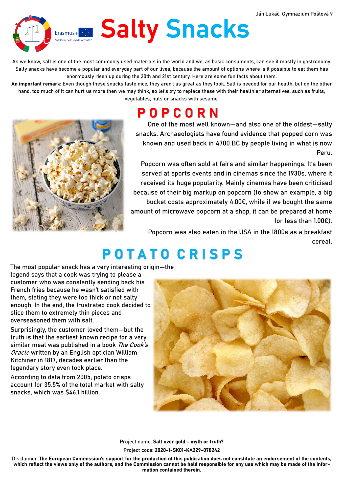
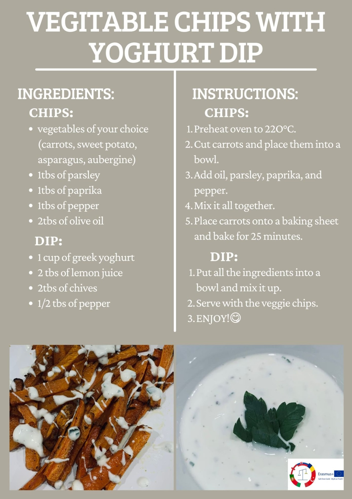
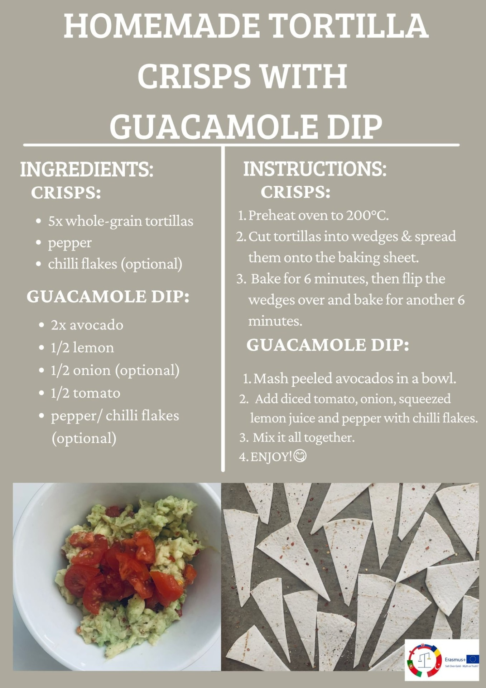
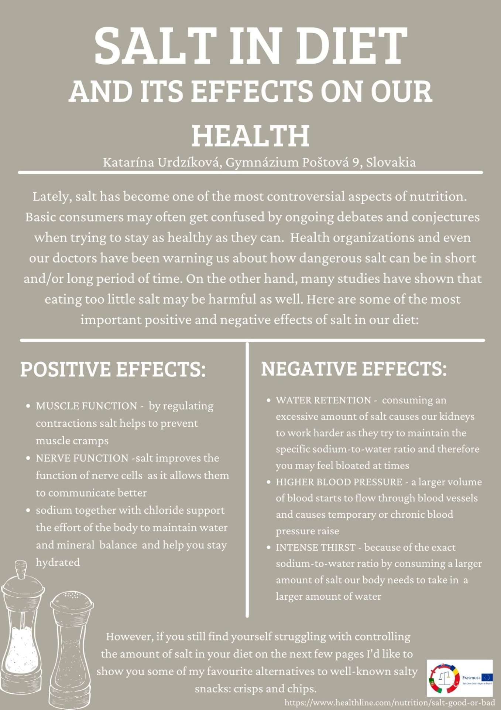
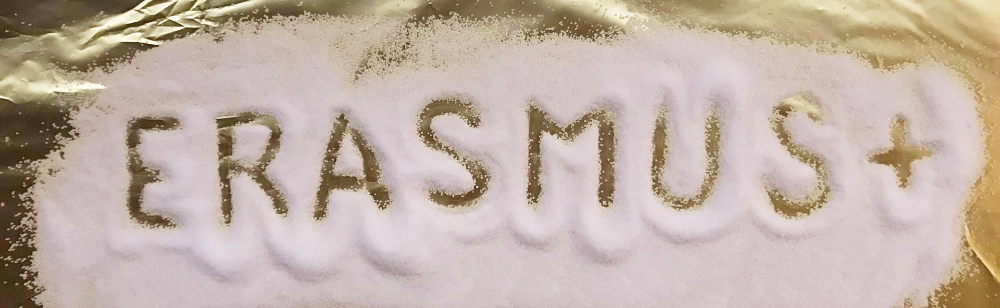
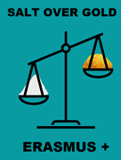

# Slovakia

## Salt in our diet

::: gallery
{onclick="window.open(this.src)"}
{onclick="window.open(this.src)"}
{onclick="window.open(this.src)"}
{onclick="window.open(this.src)"}
{onclick="window.open(this.src)"}
:::

## Websites about our project:

::: buttonList
 * [Negative effects of salt ](neg)
 * [Salt I](sol)
 * [Salt II](sal)
 * [Salt in art](ume)
 * [Salt route - Italy](tal)
 * [Salt route - Portugal](sol_takac)
 * [Surplus salt](nad)
 * [Types of salt](typ)
 * [Salt routes - Slovakia](slo)                     
 * [Salt consumtion in UK, Portugal and Turkey](kon)
 * [Salt route in Slovakia](sc)
:::

## Let's learn about salt

::: buttonList
 * [Salt routes](salt_routes.pdf)
 * [Value of salt in the past](past.pdf)
 * [Types of salt](types_of_salt.pdf)
:::

## Slovak logo designs

::: gallery
{onclick="window.open(this.src)"}
{onclick="window.open(this.src)"}
{onclick="window.open(this.src)"}
{onclick="window.open(this.src)"}
{onclick="window.open(this.src)"}
:::