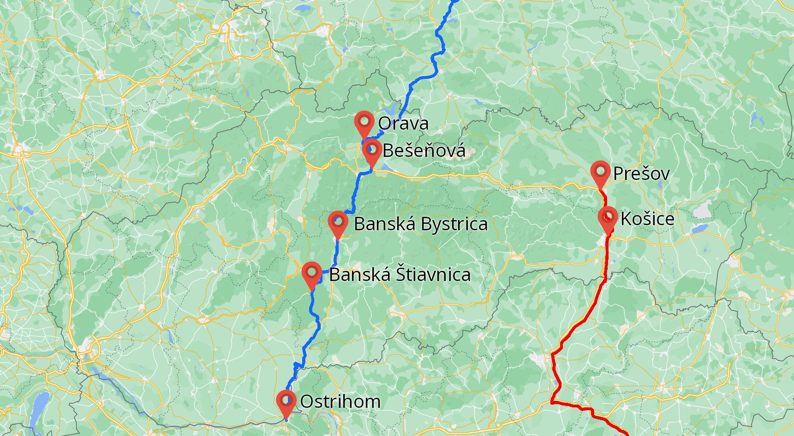

# Soľná cesta na Slovensku.

História soli súvisí s históriou ľudstva. 

**Prvé zmienky** o soli pochádzajú zo Starého zákona. **V Biblii** bola soľ považovaná za mimoriadne dôležitú látku; veriaci prinášali Bohu obetu okrem iného aj vo forme soli.
**V staroveku** sa používala ako **platobný prostriedok**. Za soľ sa dalo získať veľa cenných produktov a tovaru. V stredovekej Európe bola úloha soli natoľko ocenená, že označila cesty medzinárodného obchodu. V tomto období vznikli  tzv „soľné cesty“, teda trasy, po ktorých sa soľ prepravovala.

Územím Slovenska viedli v stredoveku **2 soľné cesty**:

1. Via Salina – viedla z Wieliczky do Ostrihomu
  * Centrá na Slovensku – Orava, Bešeňová, Banská Bystrica, Banská Štiavnica, 
2. Východoslovenská soľná cesta – viedla z Prešova na Balkán, zásobovala celé Rakúsko - Uhorsko
  * Centrá na Slovensku – Prešov, Košice              

Výskyt soli na Slovensku dokazujú dodnes **zachované názvy**:

a. dedín – Soľ, Slanec, Slančík, Solivar
b. pohoria – Slanské vrchy
c. rieky - Slaná

