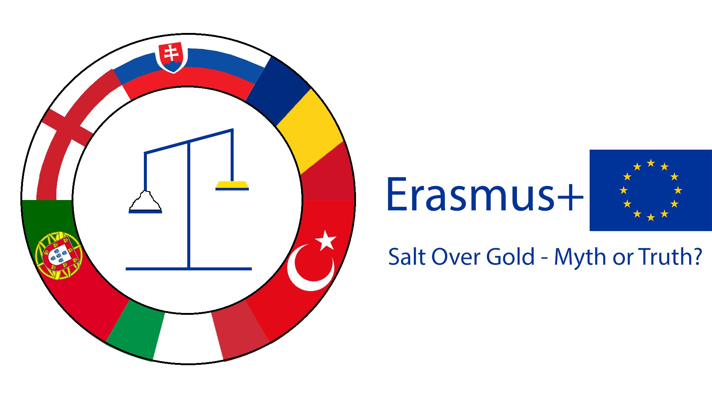
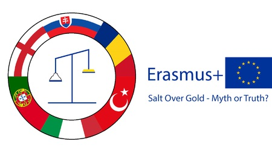
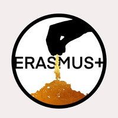
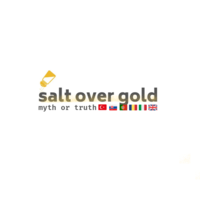

::: bigquote
{class=erazmusLogo style='float:right; max-width:20%'}
"Different people, different places, the same goal: get to know each other and have fun."
:::

::: black

:::: blackBackground
::::

:::: blackContent

## What is erasmus?

Erasmus+ is the EU's programme to support education, training, youth and sport
in Europe. Its budget of €14.7 billion will provide opportunities for over 4
million Europeans to study, train, gain experience, and volunteer abroad.

::::

:::

## Main goals

 * To find out the value of salt in the past and its value today
 * To present its negative impacts on human life and health and on the environment
 * To enrich Science lessons with funny and informative experiments, excursions, fieldwork
 * To improve students´ attitude to Science subjects and connect them with real-life situations
 * To cooperate with specialists from nutrition therapy, dietology, forestry, farming, gastronomy fields
 * to present salt in symbols, tales, rituals and salt art techniques
 * to improve students´ IT, communication, presentation skills, teamwork and creativity

::: black

:::: blackBackground
::::

:::: blackContent

## The logo competition

We would like to congratulate all our competition winners and say thank you to everyone who participated.

::::: advancedGallery
:::::: advancedGalleryItem
{onclick="window.open(this.src)"}
1st place, 85 votes, Turkey
::::::

:::::: advancedGalleryItem
{onclick="window.open(this.src)"}
2nd place, 52 votes, Slovakia
::::::

:::::: advancedGalleryItem
{onclick="window.open(this.src)"}
3rd place, 43 votes, Turkey
::::::

:::::

::::

:::